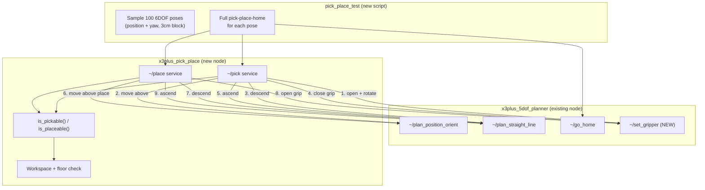
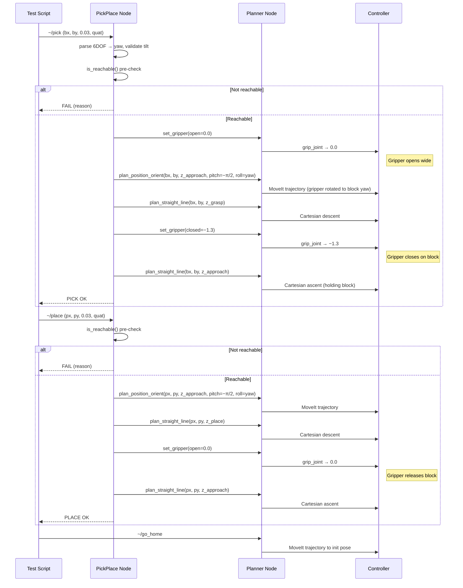

# Pick-and-Place Service — Full Cycle with 6DOF Block Pose

## Block specification

- **3 cm cube** (each side 3 cm)
- Sits flat on the floor (upper surface at z = 0.03 m)
- May have an AprilTag on its upper surface → provides a full 6DOF pose
- The 6DOF pose of the **upper surface center** is the input to the pick service

## Gripper geometry (measured from STL meshes)

When the gripper faces straight down (pitch = −π/2), from top to bottom:


| Component                                       | Height above wrist origin                   |
| ----------------------------------------------- | ------------------------------------------- |
| Grip mechanism roots (grip_joint pivot)         | +6.85 cm                                    |
| Finger bar linkages (rlink3/llink3)             | +5.05 cm                                    |
| Finger joint pivots (rlink_joint2/llink_joint2) | +4.75 cm                                    |
| arm_link5 origin (**wrist** — FK/IK target)     | 0 cm                                        |
| **Fingertip mesh** (rlink2/llink2 tips)         | **−0.3 to −1.2 cm** (depends on grip angle) |


Key constants:


| Constant                | Value   | Meaning                                                                                    |
| ----------------------- | ------- | ------------------------------------------------------------------------------------------ |
| `FINGERTIP_BELOW_WRIST` | 0.012 m | Worst-case (grip fully open) fingertip overhang below wrist                                |
| `BLOCK_HEIGHT`          | 0.03 m  | 3 cm cube                                                                                  |
| `GRASP_DEPTH`           | 0.015 m | How far below block surface to place the wrist (so ~half the block is between the fingers) |
| `APPROACH_HEIGHT`       | 0.04 m  | Wrist height above grasp height during approach/retreat                                    |
| `MIN_FLOOR_CLEARANCE`   | 0.005 m | Minimum allowed fingertip height above floor                                               |
| `GRIP_OPEN`             | 0.0     | grip_joint value for fully open                                                            |
| `GRIP_CLOSED`           | −1.3    | grip_joint value to grasp 3 cm block (tune on real robot)                                  |


## Grasp height derivation

For a block with upper surface at `z_block`:

```
z_grasp_wrist  = z_block − GRASP_DEPTH           # wrist descends below block top
                                                   # so fingers span more of the block
z_approach     = z_grasp_wrist + APPROACH_HEIGHT   # safe height above

Fingertip z during approach (open gripper):
  z_fingertip = z_grasp_wrist − FINGERTIP_BELOW_WRIST

Floor clearance check:
  z_fingertip >= MIN_FLOOR_CLEARANCE
  → z_block − GRASP_DEPTH − 0.012 >= 0.005
  → z_block >= 0.032 m  (a 3 cm block just satisfies this!)
```

For a 3 cm block on the floor: `z_block = 0.03`, `z_grasp_wrist = 0.015`,
`z_fingertip = 0.003 m` (3 mm above floor). Tight but safe.

Adjustable: if the block is thinner, reduce `GRASP_DEPTH` accordingly.
If the block is taller, more margin.

## 6DOF pose handling

Input: `geometry_msgs/Pose` (position + quaternion) of the block's upper surface.

Processing:

1. Extract position `(bx, by, bz)` — center of block's upper face
2. Extract orientation quaternion → convert to RPY
3. **Yaw** (rotation around world Z) → maps to **gripper roll (J5)**
4. **Validate tilt**: block roll and pitch must be < 5° (block is flat on floor)
5. **Map yaw to J5 range** `[−π/2, π]`:
  - If yaw is outside J5 range, try `yaw ± π` (block is symmetric for a cube)
  - If still outside, reject

The gripper **always** keeps pitch = −π/2 (face down). Only the roll (J5) changes
to align with the block's yaw.

## Architecture




## Files to Change

### 1. Modify: [x3plus_5dof_planner.py](docker_all/components/ros2_comp/app/monty_demo/monty_demo/x3plus_5dof_planner.py)

Add `~/set_gripper` service:

- New parameter: `target_grip` (float, default −0.77)
- Service callback reads current arm joint positions (or virtual state in dry-run),
builds a 2-point FJT trajectory that only changes `grip_joint` to `target_grip`,
and sends it via the existing `_execute_fjt()` method
- Duration computed from angular distance / max gripper velocity
- Supports `execute` parameter (dry-run compatible, updates virtual state)
- ~30 lines of new code

### 2. New: `x3plus_pick_place.py` — Orchestrator Node

`**is_reachable(x, y, z_wrist, roll)` function** — checks:

1. `q1 = −atan2(y, x−BASE_XY)` must be in `[−π/2, π/2]`
2. `roll` must be in `[−π/2, π]` (J5 limits)
3. Analytical IK with pitch = −π/2 must succeed at `(x, y, z_wrist, −π/2, roll)`
4. **Fingertip floor clearance**: `z_wrist − FINGERTIP_BELOW_WRIST >= MIN_FLOOR_CLEARANCE`
5. **Approach height reachable**: IK must succeed at `(x, y, z_wrist + APPROACH_HEIGHT, −π/2, roll)` too

If all pass → pickable. If any fails → descriptive rejection reason.

`**~/pick` service** (Trigger-based, reads parameters):

Parameters: `block_x`, `block_y`, `block_z`, `block_qx`, `block_qy`, `block_qz`, `block_qw`,
`approach_height` (default 0.04 m), `grasp_depth` (default 0.015 m),
`grip_open` (default 0.0), `grip_closed` (default −1.3)

Sequence:

```
1. Parse 6DOF pose → extract yaw → validate tilt → map yaw to J5 roll
2. Compute z_grasp_wrist = block_z − grasp_depth
3. Compute z_approach = z_grasp_wrist + approach_height
4. Run is_reachable(bx, by, z_grasp_wrist, roll) — reject immediately if not
5. set_gripper(grip_open)                          — open gripper wide
6. plan_position_orient(bx, by, z_approach,        — move above block, gripper down
                        pitch=−π/2, roll=yaw)         rotated to match block
7. plan_straight_line(bx, by, z_grasp_wrist)       — descend to grasp
8. set_gripper(grip_closed)                        — close gripper on block
9. plan_straight_line(bx, by, z_approach)           — lift with block
```

`**~/place` service** (Trigger-based, reads parameters):

Parameters: `place_x`, `place_y`, `place_z`, `place_qx`, `place_qy`, `place_qz`, `place_qw`,
`approach_height` (default 0.04 m), `grasp_depth` (default 0.015 m),
`grip_open` (default 0.0)

Sequence:

```
1. Parse 6DOF place pose → extract yaw → validate tilt → map yaw to J5 roll
2. Compute z_place_wrist = place_z − grasp_depth
3. Compute z_approach = z_place_wrist + approach_height
4. Run is_reachable(px, py, z_place_wrist, roll) — reject immediately if not
5. plan_position_orient(px, py, z_approach,       — move above place location
                        pitch=−π/2, roll=yaw)
6. plan_straight_line(px, py, z_place_wrist)      — descend to place height
7. set_gripper(grip_open)                         — release block
8. plan_straight_line(px, py, z_approach)          — retreat upward
```

### 3. New: `pick_place_test.py` — 100-Point 6DOF Test

Follows the pattern of [straight_line_test.py](docker_all/components/ros2_comp/app/monty_demo/monty_demo/straight_line_test.py).

**Point generation** (`generate_candidates`):

Sample 100 **6DOF block surface poses** within the pickable workspace:

- `z_block` = 0.03 m (simulated 3 cm cube on floor)
- `z_grasp_wrist = z_block − GRASP_DEPTH` = 0.015 m
- Azimuth: `θ ∈ [−π/2, π/2]` (J1 range)
- Radial distance: `r` such that `(x, y, z_grasp_wrist)` has valid IK with pitch = −π/2
- Yaw (block rotation): random `∈ [−π/2, π]` (J5 range)
- Convert `(r, θ)` → `(x, y)` in Cartesian
- **Reject immediately** if `is_reachable()` fails at grasp OR approach height
- Enforce minimum distance between sampled points

**Test execution** — for each of the 100 poses, full pick-place-home cycle:

```
1. ~/pick(block_x, block_y, 0.03, quat_from_yaw(yaw))
     → open gripper, rotate to yaw
     → move above, descend, close gripper, ascend
2. ~/place(place_x, place_y, 0.03, quat_from_yaw(yaw+offset))
     → move above place pos, descend, open gripper, ascend
3. ~/go_home
```

The place position is offset from pick by a fixed delta (e.g. 3 cm in Y)
so the arm demonstrates actual movement between pick and place.

**Even without a real block**: the gripper **physically opens, rotates** to match
each sampled yaw, descends, **closes** (as if grasping), ascends, moves to place,
descends, **opens** (as if releasing), ascends, and goes home. Every cycle exercises
the full gripper actuation.

**CLI flags**:

- `--generate-only`: sample and visualize poses (no ROS)
- `--dry-run`: plan but don't execute
- `-n NUM`: number of poses (default 100)
- `--seed`: random seed
- `--pause`: delay between cycles (default 0.5 s)

**Visualization**: 4-panel plot (3D with yaw arrows, top XY, side R-vs-Z,
segment histogram) colored by pass/fail, showing the pickable workspace
boundary as reference.

### 4. Modify: [setup.py](docker_all/components/ros2_comp/app/monty_demo/setup.py)

Add two new entry points:

```python
"x3plus_pick_place = monty_demo.x3plus_pick_place:main",
"pick_place_test = monty_demo.pick_place_test:main",
```

## Full Cycle Sequence Diagram




## Safety Checklist


| Check                     | Where            | What                                        |
| ------------------------- | ---------------- | ------------------------------------------- |
| Fingertip floor clearance | `is_reachable()` | `z_wrist − 0.012 >= 0.005`                  |
| J1 azimuth range          | `is_reachable()` | `abs(q1) <= π/2`                            |
| J5 roll range             | `is_reachable()` | `−π/2 <= roll <= π`                         |
| IK at grasp height        | `is_reachable()` | analytical_ik_5d succeeds with pitch = −π/2 |
| IK at approach height     | `is_reachable()` | analytical_ik_5d succeeds at z_approach too |
| Block tilt                | `~/pick` service | block roll & pitch < 5°                     |
| Workspace bounds          | analytical_ik_5d | standard workspace check                    |
| Gripper pitch invariant   | Entire pipeline  | pitch = −π/2 in **every** motion command    |
| Consecutive fail abort    | test script      | Stop after 5 consecutive failures           |


